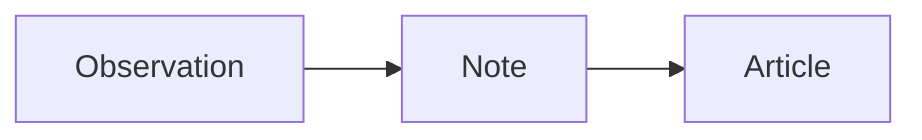

# Writing

Use Markdown for ordinary writing and MDX when a piece needs an Astro component. Posts hold articles, essays, and diary entries; notes appear together in a chronological stream.

## Add a piece

Create a file in `src/content/posts/en/`, `src/content/posts/zh-hans/`, or the corresponding `src/content/notes/` folder.

```yaml
---
translationKey: a-small-observation
locale: en
title: A small observation
description: A thought I wanted to keep.
slug: a-small-observation
publishedAt: 2026-09-13
draft: true
---
```

Only `draft` is optional in this example. Use lowercase words joined by hyphens for `slug` and `translationKey`; the locale must match the folder. Keep slugs stable after publication. Posts receive their own URL; note slugs become fragments on the notes page.

| Optional field | Use                                                                      |
| -------------- | ------------------------------------------------------------------------ |
| `updatedAt`    | Date of a revision, displayed on articles                                |
| `tags`         | Topic IDs from [tags.ts](../src/i18n/tags.ts); defaults to an empty list |
| `draft`        | Exclude from public output; defaults to `false`                          |
| `sample`       | Show the example label; defaults to `false`                              |
| `license`      | Defaults to `CC-BY-NC-SA-4.0`, the only accepted value                   |

Use `YYYY-MM-DD` dates. A future date does **not** schedule publication. Remove `draft: true` when ready; published entries appear newest first in the appropriate index and RSS feed. The [schema](../src/content.config.ts) is the field authority.

## Translate a piece

Add a separate file in the other locale folder with the same `translationKey`. Translate the title, description, and body naturally; the slug and dates may differ. Posts link to published counterparts and explain when one is missing. Notes switch between localized streams.

Interface text belongs in `src/i18n/en.ts` and `src/i18n/zh-hans.ts`, not in article frontmatter or bilingual template conditionals.

## Code, math, and diagrams

Name the language on fenced code blocks, such as `ts`, `css`, or `sh`. Highlighting and language labels are generated automatically; copy controls appear when supported.

Use `$…$` for inline math and `$$…$$` on separate lines for display math. Temml renders formulas at build time with STIX Two Math. Invalid TeX fails the build. Macros are scoped to one source document. Equation references such as `\eqref{label}` need JavaScript; keep equation labels unique across notes sharing a page.

Use ordinary Mermaid fences in either format. Include an accessible title, description, and surrounding prose that explains the diagram:

````md

````

Diagrams render in the browser and follow the site’s theme. Without enhancement, readers see the source.

An MDX file can import a component directly. From a locale content folder:

```mdx
import EasingExperiment from "../../../components/EasingExperiment.astro";

<EasingExperiment locale="en" />
```

Use `locale="zh-hans"` in Chinese writing. MDX is executable repository content; only add trusted source.

## Before publishing

Run `pnpm verify`, then review the built site with `pnpm preview`. Check links, title wrapping, code, math, and diagrams in the piece’s language and both themes. Existing example pieces carry `sample: true`; replace their content before removing that label. Some output tests use these examples as fixtures, so update those checks when replacing them.

Text uses CC BY-NC-SA 4.0; project code and code examples use MIT. Templates display both terms automatically. See the [license scope](../README.md#license) for third-party exceptions.
