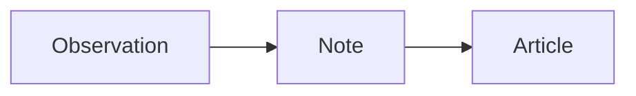

# Writing

Use Markdown for prose and MDX for pieces that embed Astro components. Posts hold articles, essays, and diary entries; notes share a chronological stream.

## Add a piece

Create a file under `src/content/posts/{locale}/` or `src/content/notes/{locale}/`, where the locale is `en` or `zh-hans`.

```yaml
---
translationKey: a-small-observation
locale: en
title: A small observation
description: A thought I wanted to keep.
slug: a-small-observation
publishedAt: 2026-09-13
draft: true
---
```

Only `draft` is optional here. Slugs and translation keys use lowercase words joined by hyphens; the locale must match the folder. Keep public slugs stable. Posts receive separate URLs; note slugs become fragments.

| Optional field | Meaning                                                            |
| -------------- | ------------------------------------------------------------------ |
| `updatedAt`    | Revision date, displayed on articles                               |
| `tags`         | IDs from [entries.ts](../src/publication/entries.ts); default `[]` |
| `draft`        | Exclude from public output; default `false`                        |
| `sample`       | Display the sample label; default `false`                          |
| `license`      | Defaults to the only accepted value, `CC-BY-NC-SA-4.0`             |

Use `YYYY-MM-DD` dates. Future dates do **not** schedule publication; `draft` controls visibility. The [content schema](../src/content.config.ts) is authoritative.

## Translate

Add a file in the other locale folder with the same descriptive filename and `translationKey`. Translate the title, description, and body naturally; slugs and dates may differ. The filename organizes source, the key links translations, and the slug determines the URL. Articles link to published counterparts; notes switch between edition streams.

Interface copy belongs in `src/i18n/en.ts` and `src/i18n/zh-hans.ts`. Follow the [voice guidance](design.md#language-and-voice).

## Code and math

Specify a language on code fences, such as `ts`, `css`, or `sh`. Expressive Code supplies highlighting, copy controls, frames, and markers.

| Fence metadata          | Use                                   |
| ----------------------- | ------------------------------------- |
| `title="example.ts"`    | Show a filename                       |
| `{2-4}`                 | Highlight lines                       |
| `ins={3}` / `del={2}`   | Mark additions or removals            |
| `showLineNumbers=false` | Hide numbering for a short snippet    |
| `startLineNumber=10`    | Start an excerpt at its original line |

See [frames](https://expressive-code.com/key-features/frames/), [markers](https://expressive-code.com/key-features/text-markers/), and [line numbers](https://expressive-code.com/plugins/line-numbers/). These work in Markdown and MDX.

Use `$…$` for inline math and `$$…$$` on separate lines for display math. Invalid TeX fails the build; macros are document-scoped. Equation references such as `\eqref{label}` need JavaScript. Keep labels unique across notes sharing a page.

## Diagrams and components

Mermaid fences work in either format. Supply an accessible title and description, and explain the diagram in surrounding prose:

````md

````

Diagrams render in the browser; without enhancement, readers see the source.

From a locale content folder, MDX can import an Astro component:

```mdx
import EasingExperiment from "../../embeds/easing/Easing.astro";

<EasingExperiment locale="en" />
```

Use `locale="zh-hans"` for Chinese. Keep each embed’s code, copy, and styles under `src/content/embeds/`; import assets from `src/content/assets/`. Embeds accept props and own their effects, without importing the blog’s interface or navigation. MDX executes at build time; only add trusted source.

## Images and supporting detail

Store article images in `src/content/assets/` for Astro optimization. Markdown accepts ordinary image syntax. For a caption in MDX:

```mdx
import Figure from "../../embeds/Figure.astro";
import image from "../../assets/spacing.webp";

<Figure src={image} alt="Two layouts with different paragraph spacing.">
  The same text, with more room between paragraphs on the right.
</Figure>
```

Alt text describes what matters in the image; captions add context or attribution. Astro supplies dimensions and responsive sources. A native `<details>` and descriptive `<summary>` can hold a supporting derivation without interrupting the main argument.

Tags generate topic pages. Search, related reading, RSS, and sharing cards use existing content and metadata; no extra publication steps are needed.

## Publish

Remove `draft: true`, run `pnpm verify`, and review `pnpm preview`. Check title wrapping, links, search, code, math, diagrams, and sharing cards in both themes. Samples retain `sample: true` until replaced; update any output tests that use them as fixtures.

Templates display the licenses automatically: CC BY-NC-SA 4.0 for text, MIT for code. See [license scope](../README.md#license).
