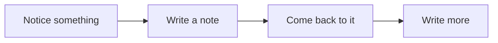

Open an article you saved weeks ago. You probably want to find the sentence that made you save it. A large introduction, a moving background, and three invitations to subscribe can all get in the way of that small task.

That is a useful place to start designing a blog: someone has come here to read something.

## Start with the next sentence

A title helps a reader choose. A summary gives them a little more to go on. Once they begin, the paragraphs should carry the page.

This sounds obvious until everything else starts asking for space. Tags, dates, menus, related articles: each can be useful, but they do not all need the same emphasis.

| On the page       | What it helps with           | Where it belongs                        |
| ----------------- | ---------------------------- | --------------------------------------- |
| Title and summary | Deciding whether to read     | Near the top, easy to scan              |
| Publication date  | Judging the context          | Beside the other metadata               |
| Section links     | Finding a particular passage | Within reach, out of the reading column |
| More articles     | Choosing what to read next   | After the piece has ended               |

A date matters differently in a JavaScript tutorial and a diary entry. The layout can make room for both without turning every piece into the same kind of article.

## Leave useful space

Spacing tells us which things belong together. Put a caption close to its image and leave a larger gap before the next section. Give a heading enough room to introduce what follows.

> A useful test: remove the borders for a moment. Can you still tell how the page is organized?

If everything falls apart, the spacing may be relying on the lines to do too much work.[^spacing]

## Make room for unfinished thoughts

Not every observation needs an introduction and a conclusion. A short note can hold a question until there is enough to say about it.

The last step is optional. A note that stays three sentences long has still done its job.

## Let the page settle

Movement can help explain a change: the title you chose becomes the heading of the article you opened. Once you start reading, there is little reason for that movement to continue.

A personal site can have a distinctive shape, a particular color, an odd little detail you remember. Those choices work best when they leave the words somewhere comfortable to sit.

[^spacing]: Try this at a narrow width too. A relationship that looks clear across a desktop row may disappear when its parts stack vertically.
