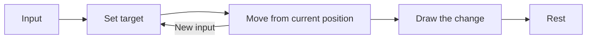

import EasingExperiment from "../../../components/EasingExperiment.astro";

Slide a book into place on a desk. Near the end, your hand slows. That small adjustment is easy to overlook until you watch a square cross a screen at constant speed and stop dead.

The destination is right. The arrival feels wrong.

## Time is not distance

Let $t \in [0,1]$ be the fraction of elapsed time, and $f(t)$ the fraction of distance travelled. With linear motion, $f(t)=t$: halfway through the time, the marker is halfway there.

A cubic ease-out curve covers the ground differently:

$$
\begin{equation}
f(t) = 1 - (1-t)^3 \label{ease}
\end{equation}
$$

At $t=0.5$, equation $\eqref{ease}$ gives $f(t)=0.875$. The marker has travelled 87.5% of the distance. It spends the second half of its time on the short stretch that remains.

<EasingExperiment />

## Look at the last few moments

The derivative describes the pace along the way:

$$
f'(t)=3(1-t)^2, \qquad f'(0)=3, \qquad f'(1)=0.
$$

The curve begins quickly and slows to zero. A small response to a click may suit that quick start. A large title crossing the page may need a gentler departure as well.

The area under each position curve tells us something else:

$$
\int_0^1 t\,dt = \frac{1}{2}, \qquad
\int_0^1 f(t)\,dt = \frac{3}{4}.
$$

Over this unit interval, the areas are also the average positions. The eased marker's average is farther along the track: it gets close to the end early, then takes its time arriving.

<details>
  <summary>A closer look at the integral</summary>

Expand the cubic: $1-(1-t)^3=3t-3t^2+t^3$. Integrating each term from zero to one gives $3/2-1+1/4=3/4$.

</details>

## Keep the path separate

The curve can supply a weight between two positions:

$$
\mathbf{p}(t) = \bigl(1-f(t)\bigr)\mathbf{p}_0 + f(t)\mathbf{p}_1.
$$

Apply it to each coordinate, and the same pace works along any straight path.

```ts title="position.ts" {4}
const easeOut = (t: number) => 1 - (1 - t) ** 3;

const position = (start: number, end: number, t: number) =>
  start + (end - start) * easeOut(t);
```

Distance still changes the feeling. A small nudge and a journey across half the screen cannot share a duration without moving at very different speeds. Judge the curve where it will be used, at the size it will appear.

## Leave room for another input

The reader may click again before the marker arrives. Continue from its present position toward the new target. Jumping back to the start would break the very continuity the animation was meant to provide.



When the reader asks for less motion, remove the travel. When the picture stops changing, stop drawing. A pause should be allowed to remain a pause.
