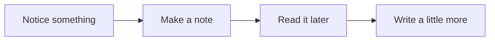

import Figure from "../../../components/Figure.astro";
import spacing from "../../../assets/spacing.webp";

You open an article saved weeks ago, looking for one sentence. You remember roughly where it was. First, though, a banner slides into view. Then a subscription prompt. The sentence can wait, apparently.

A blog is often visited this way: with a small purpose, and less patience than its maker imagined.

## Start with the next sentence

The title gets someone to open a page. After that, the writing needs room to hold their attention.

Dates, tags, and menus still have work to do. A publication date helps place a tutorial in time; a contents list helps someone find a passage. Giving each a clear place is usually enough.

| On the page       | What it helps with        | Where it belongs                        |
| ----------------- | ------------------------- | --------------------------------------- |
| Title and summary | Choosing a piece          | At the beginning                        |
| Publication date  | Understanding its context | Beside the other article details        |
| Section links     | Returning to a passage    | Within reach, beside or above the prose |
| More articles     | Finding something else    | After the piece ends                    |

The date on a diary entry carries a different weight from the date on a JavaScript tutorial. A little flexibility in the layout lets each remain what it is.

## Leave useful space

A caption belongs close to its image. A heading needs more space above it than below, so it stays with the paragraph it introduces. These small distances tell us how to read a page before we have read a word.

<Figure
  src={spacing}
  alt="Two layouts of the same text: tightly spaced on the left, with clearer gaps between sections on the right."
>
  The words stay the same. The space around them changes the pace.
</Figure>

> Hide the dividing lines for a moment. Can you still see what belongs together?

If the groups become hard to distinguish, adjust their spacing before putting the lines back.[^spacing]

## Make room for unfinished thoughts

Some observations are only a few sentences long. They can stay that way. Writing one down gives you somewhere to return when another thought arrives.

There is no deadline for that last step. A short note may already say all it needs to.

## Let the page settle

A title moving into place can help connect a click with the article it opens. When the movement ends, the reader should be free to forget the interface.

There is still room for a particular color, a curious shape, a small detail that makes the site yours. Let it catch the eye on the way in. The words can take it from there.

[^spacing]: Check at a narrow width, too. Elements that belong together in a desktop row need to keep that relationship when stacked on a phone.
