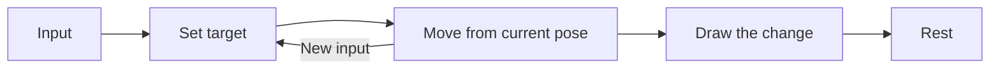

import EasingExperiment from "../../../components/EasingExperiment.astro";

Imagine sliding a book across a desk. You ease your hand off as it reaches the spot you want. A marker moving at a constant speed and stopping in a single frame misses that last part.

We can change how it stops without changing where it goes.

## Time is not distance

Let $t \in [0,1]$ be the fraction of elapsed time. Linear motion uses $f(t)=t$: halfway through the time, it has covered half the distance.

A cubic ease-out curve behaves differently:

$$
\begin{equation}
f(t) = 1 - (1-t)^3 \label{ease}
\end{equation}
$$

At $t=0.5$, equation $\eqref{ease}$ gives $f(t)=0.875$. The marker is already close to the end. It spends the remaining time slowing down.

<EasingExperiment />

## Look at the last few moments

The derivative tells us how quickly the position changes:

$$
f'(t)=3(1-t)^2, \qquad f'(0)=3, \qquad f'(1)=0.
$$

The ending is gentle, but the beginning is quick. That can work for a small response to a click. A large title travelling across the page may need a softer start as well. An ease-out curve is one tool, not a rule for every animation.

The area under the curve adds another way to compare the two motions:

$$
\int_0^1 t\,dt = \frac{1}{2}, \qquad
\int_0^1 f(t)\,dt = \frac{3}{4}.
$$

These are average positions over the duration. They tell us the eased marker spends more time toward the far end of the track.

## Keep the path separate

For a movement between two points, the curve supplies a weight:

$$
\mathbf{p}(t) = \bigl(1-f(t)\bigr)\mathbf{p}_0 + f(t)\mathbf{p}_1.
$$

Apply that weight to each coordinate. The same timing works whether the path is horizontal, vertical, or diagonal.

```ts
const easeOut = (t: number) => 1 - (1 - t) ** 3;

const position = (start: number, end: number, t: number) =>
  start + (end - start) * easeOut(t);
```

The distance still matters. A movement across half the screen will feel faster than a small nudge if both take the same time. Tune the curve while looking at the actual size and travel.

## Leave room for another input

A reader may scroll, click somewhere else, or change their motion preference before the animation ends. The current position is a better starting point for the next response than the beginning of the old animation.



Once the picture stops changing, drawing the same frame again does not improve it. Let the scene rest until there is something new to show.
