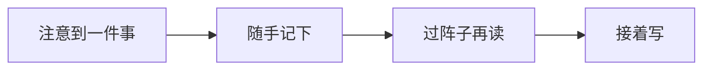

打开一篇收藏了很久的文章，你可能只是想找回当时划下的那句话。可页面先放了一段开场动画，又弹出订阅提示，正文还在下面。

做博客时，可以先记住这件小事：有人是专程来读东西的。

## 先让下一句话好读

标题帮人判断要不要点开，摘要再补充一点线索。开始阅读以后，就该让段落接着往下讲。

日期、标签、目录、相关文章都有用，但不必同样显眼。把这些东西一股脑堆在开头，读者反倒要先找正文在哪。

| 页面内容   | 能帮读者做什么   | 适合放在哪里           |
| ---------- | ---------------- | ---------------------- |
| 标题和摘要 | 判断要不要读     | 页面开头，便于扫一眼   |
| 发布日期   | 了解写作背景     | 和其他文章信息放在一起 |
| 目录       | 找到某一节       | 容易找到，但不挤占正文 |
| 其他文章   | 决定接下来读什么 | 这一篇读完以后         |

一篇 JavaScript 教程的日期，和一篇日记的日期，意义并不相同。版面可以兼顾两者，不必把所有文章都装扮成技术教程。

## 留白也要有用

图注离图片近一点，下一节离上一段远一点，标题和它下面的文字靠近一点。间距能把关系交代清楚。

> 暂时去掉分隔线，看看还能不能认出页面的层次。

如果没了线就乱成一片，或许该先调间距，而不是再画几条线。[^spacing]

## 没想完的也可以记

一个小观察，不一定需要开头、论证和结尾。先写成短记，等以后有了新想法，再回来接着写。

不走到最后一步也没关系。一直只有三句话的短记，也不算白写。

## 读起来以后，就安静些

动画可以交代变化：刚点下的标题，移到了文章开头。等读者开始看正文，它就完成任务了。

个人网站当然可以有自己的样子。一个特别的配色，一点空间感，甚至一个没什么实用价值的小细节，都可以留下。只要文字还有个舒服的位置。

[^spacing]: 别忘了缩窄窗口再看一遍。桌面上排在同一行的东西，到了手机上可能已经看不出关联。
