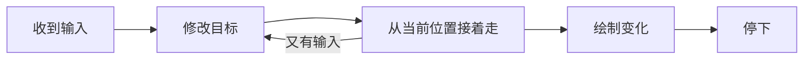

import EasingExperiment from "../../../components/EasingExperiment.astro";

把桌上的一本书推到手边，快到地方时，手会稍微收一点力。屏幕上的方块如果始终匀速，到了终点突然停住，就少了这一下。

起点和终点不动，只调整中间的节奏，感觉就会不同。

## 时间走了一半，路呢

用 $t \in [0,1]$ 表示已经过去的时间占比。匀速运动对应 $f(t)=t$：时间过半，路也走了一半。

换成三次缓出曲线，情况就不一样了：

$$
\begin{equation}
f(t) = 1 - (1-t)^3 \label{ease}
\end{equation}
$$

把 $t=0.5$ 代入公式 $\eqref{ease}$，得到 $f(t)=0.875$。方块已经走了八成多，剩下的时间用来慢慢靠近终点。

<EasingExperiment locale="zh-hans" />

## 看看最后那一点路

对位置求导，就能看到速度怎么变：

$$
f'(t)=3(1-t)^2, \qquad f'(0)=3, \qquad f'(1)=0.
$$

终点的速度降到了零，但起步的速度并不小。用来回应一次点击，这种利落的出发可能很合适；如果是大标题横跨半个页面，起步也许还得柔和一点。缓出曲线好用，却不适合包办所有动画。

再比较两条曲线下的面积：

$$
\int_0^1 t\,dt = \frac{1}{2}, \qquad
\int_0^1 f(t)\,dt = \frac{3}{4}.
$$

它们表示整段时间里的平均位置。缓出方块的平均位置更靠前，也就是说，它有更多时间待在轨道后半段。

## 路径和节奏分开调

从一个点走到另一个点，可以把缓动结果作为权重：

$$
\mathbf{p}(t) = \bigl(1-f(t)\bigr)\mathbf{p}_0 + f(t)\mathbf{p}_1.
$$

每个坐标都用同一个权重。无论横着走、竖着走，还是斜着走，都能保留相同的节奏。

```ts
const easeOut = (t: number) => 1 - (1 - t) ** 3;

const position = (start: number, end: number, t: number) =>
  start + (end - start) * easeOut(t);
```

当然，距离也会影响感觉。同样的时长，挪几像素和走过半个屏幕，速度差得很远。调曲线时，还是得放回实际页面里看。

## 读者不一定等你播完

动画还没结束，读者可能就滚动了页面、点了别处，或者打开了减少动态效果的设置。下一次响应应该从此刻的位置接上，而不是跳回上一段动画的起点。



等到画面不再变化，就让它停着。重复画同一帧，并不会让静止的画面更好看。
