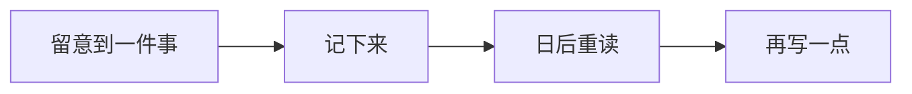

import Figure from "../../embeds/Figure.astro";
import spacing from "../../assets/spacing.webp";

重新打开一篇收藏已久的文章，有时只是为了找一句话。还记得它大约在什么位置，页面却先弹出横幅，又请你订阅。那句话，只好再等一等。

做网页的人容易忘记：读者来时，往往已经有了想找的东西。

## 读者来找什么

标题让人点进来，接下来就靠文字了。

日期、标签和目录仍然有用。读技术文章时，日期能提醒我们留意版本；重读一篇长文时，目录能省去来回翻找的工夫。各有位置，就不必争着显眼。

| 页面内容   | 用处             | 位置                   |
| ---------- | ---------------- | ---------------------- |
| 标题和摘要 | 判断是否想读     | 文章开头               |
| 发布日期   | 了解写作时的背景 | 和其他文章信息放在一起 |
| 目录       | 找回某一段       | 正文旁边，或正文之前   |
| 其他文章   | 找到下一篇       | 这一篇结束以后         |

教程上的日期，关乎知识是否还适用；日记上的日期，把一天留了下来。同一张版面，也该容得下这点不同。

## 空白里的关系

图注靠近图片，标题靠近它领起的段落，章节之间多留一点距离。字还没读，关系已经看出来了。

<Figure
  src={spacing}
  alt="同样的文字排成两张版面：左边紧凑，右边用较大的间距分清章节。"
>
  文字没变，四周松开一点，阅读的节奏就变了。
</Figure>

> 暂时藏起分隔线，看看哪些内容属于一组，还认不认得出来。

如果层次变得含混，先调一调间距，再把线放回去。[^spacing]

## 没想完的也可以记

有些念头只有两三句，不必为了凑成文章再添一段道理。先记下，下次想到这里，便有个接着写的地方。

最后一步不用着急。也许那三句话，已经够了。

## 读进去以后

点下的标题移到文章开头，动画把这一步交代清楚。读者开始看正文，动画也就该停了。

个人网站仍然可以有自己的脾气：一种偏爱的颜色，一个特别的形状，一处让人记住的小细节。进门时看见它，坐下来以后，还有地方安心读书。

[^spacing]: 也要缩窄窗口看看。电脑上横排时清楚的关系，到了手机上纵向排列，仍然应该认得出来。
